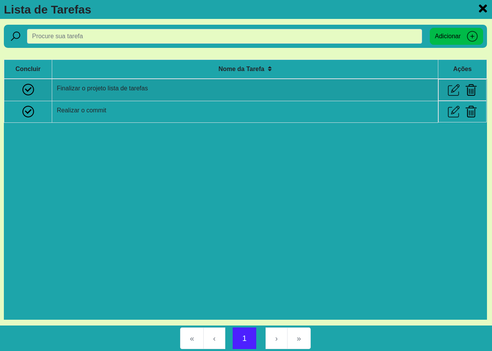

# Projeto Lista de Tarefas
* Projeto em Reactjs, onde vou está aplicando todos os conceitos aprendidos no curso da udemy 'https://www.udemy.com/course/aprenda-react-hooks-8-projetos-praticos/', com algumas modificações e usando uma API que nesse momento vai está salvando as tarefas em memoria.

* Dentro do <b>README</b> da pasta do projeto está tudo que está sendo usando.
   * https://github.com/thiagoadssilva/thiagoListaTarefas/blob/main/frontend/README.md

## Protótipo criado com a plataforma 'FIGMA'
  * https://www.figma.com/proto/jzQqLzzNjxZyLb8KmkKfKp/Untitled?node-id=1%3A20&frame-preset-name=Desktop&scaling=scale-down

## Observações 
- Todo parte das informações das tarefa está sendo feita através de uma api, porém essa api, não está usando banco de dados, apenas a memoria.

## <b>Tela de Inicio</b> 

## <b>Tela de Inicio</b> 

